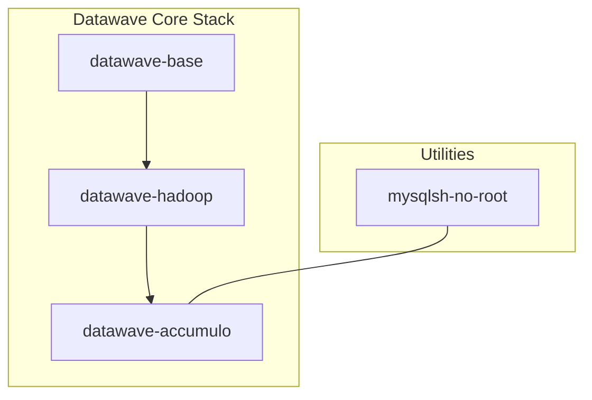

# Datawave Stack Docker Images

[](https://opensource.org/licenses/Apache-2.0)

> **Streamlining Big Data Ingest and Querying**

This repository contains the official Docker images and build configurations for the **DATAWAVE Stack**. DATAWAVE is a powerful ingest and query framework developed by the **National Security Agency (NSA)** that leverages Apache Accumulo to provide high-performance data storage and retrieval.

## 🌊 Overview

The `datawave-stack-docker-images` project provides a set of containerized components required to deploy and run a full Datawave environment. These images are designed to be used in conjunction with one another, providing a scalable and reproducible stack for big data operations.

## 🏗 Architecture

The stack consists of several key layers, each serving a specific purpose in the Datawave ecosystem:



## 📦 Container Images

### [datawave-base](./datawave-base)

The foundational image for all other Datawave components. It provides common environment variables, dependencies, and OS-level configurations.

### [datawave-hadoop](./datawave-hadoop)

A pre-configured Hadoop environment tailored for Datawave. It includes Spark and other essential Big Data libraries.

### [datawave-accumulo](./datawave-accumulo)

The core storage and indexing engine. This image contains Apache Accumulo optimized for Datawave's unique indexing strategies.

### [mysqlsh-no-root](./mysqlsh-no-root)

A utility container providing the MySQL Shell in a rootless environment, useful for database management and integration tasks.

## 🚀 Getting Started

### Prerequisites

- Docker (v20.10+)
- Docker Compose (v2.0+)

### Building Images Locally

You can build the images individually using the provided Dockerfiles:

```bash
# Build the base image
docker build -t datawave/base ./datawave-base

# Build the Hadoop image
docker build -t datawave/hadoop ./datawave-hadoop

# Build the Accumulo image
docker build -t datawave/accumulo ./datawave-accumulo
```

## 🛠 Configuration

Each image is highly configurable via environment variables. Key configuration files are located within each subdirectory:

- `datawave-accumulo/conf`: Accumulo site configurations.
- `datawave-accumulo/entrypoint.sh`: Initialization logic for the Accumulo container.

## 🤝 Contributing

We welcome contributions to the Datawave Stack Docker Images project! If you find a bug or have a feature request, please open an issue or submit a pull request.

Contributions to this project are subject to the [official NSA contributing guidelines](https://github.com/NationalSecurityAgency/.github/blob/main/CONTRIBUTING.md).

---

Made with ❤️ by the **NSA Open Source Community**
